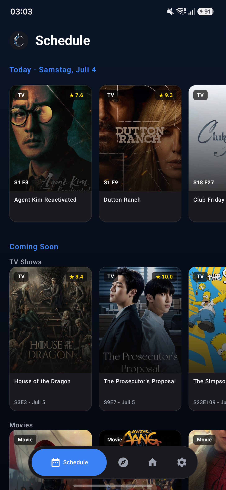
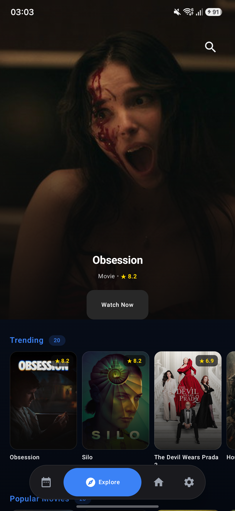
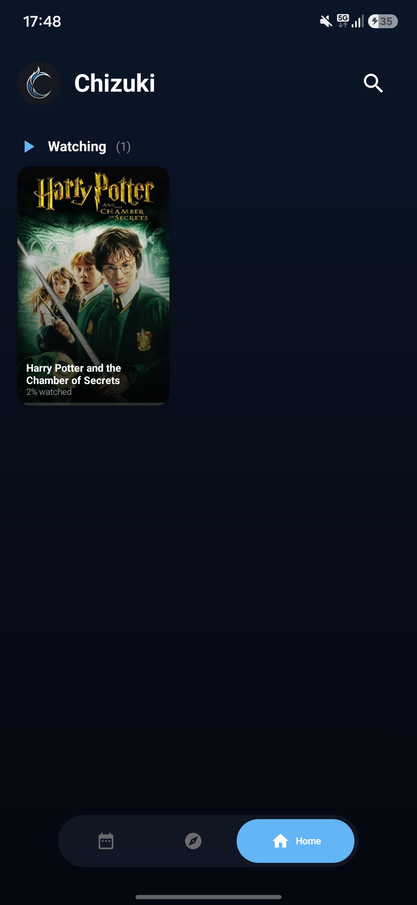

# Chizuki

A modern Android tracking app for discovering movies and TV shows.


## Screenshots

| Schedule | Explore | Home | Player |
|----------|---------|------|--------|
|  |  |  |  |

## Features

- **TMDB Integration** - Browse trending, popular, and top-rated movies and TV shows
- **Progress Tracking** - Automatically save watch progress
- **My Lists** - Organize content with Watching, Planning, Completed, On Hold, and Dropped lists
- **Explore** - Discover content by genre (Action, Comedy, Horror, Sci-Fi, and more)
- **Search** - Instant debounced search across movies and TV shows
- **Extension System** - Plugin architecture for third-party streaming sources
- **Video Player** - HLS playback with ExoPlayer, speed control, aspect ratio adjustment, double-tap seek, skip gestures
- **Episode Selection** - Season and episode picker for TV shows
- **Auto-next Episode** - Seamless playback continuation
- **Schedule** - Track airing today and upcoming releases

## Requirements

- Android 8.0+ (API 26+)

## Building from source

1. Clone the repo
2. Create a `local.properties` file in the project root with your TMDB API key:
   ```properties
   TMDB_API_KEY=your_tmdb_api_key_here
   ```
3. Open in Android Studio or build with `./gradlew assembleRelease`

> **Note:** `local.properties` is gitignored. Release signing keys are also configured via this file.

## Installation

Download the APK from [Releases](https://github.com/Suntrax/chizuki/releases) and install.

## Tech Stack

- **Kotlin + Jetpack Compose** - UI framework
- **Media3 ExoPlayer** - Video playback
- **TMDB API** - Movie and TV show metadata
- **Glide** - Image loading and caching
- **MVVM Architecture** - ViewModel + StateFlow pattern

## Forking the repository

`local.properties` file with the following keys needed:

TMDB_API_KEY

## Disclaimer

This project is for educational purposes only. It does not host, store, or distribute any copyrighted content. Users are solely responsible for compliance with applicable laws in their jurisdiction. All third-party APIs and services used are independent and not affiliated with this project.
